# Base-FL: A Flower / PyTorch app for Anomaly Detection 

## Dataset
Distribution of data in UNSW-NB15 Dataset 
|  Label   |  Count   |  Percentage |
| -------- | -------- |  ---------- |
| Normal   | 2,218,760   |  87.351277    |
| Anomalous   | 321,283   |   12.648723    |
| Total   | 2,540,043   |   100.00    |

Training Set: 80% of the normal data was allocated for training. <br>
Test Set: The remaining 20% of the normal data was combined with the anomalous data to form the test set. 

The dataset dimensions are as follows: 
- Training Set Size **train.csv**: (1775008, 206) 
- Test Set Size **test.csv**: (765035, 206)

Distribution of data in test.csv
|  Label   |  Count   |  Percentage of total UNSW-NB15 Dataset| 
| -------- | -------- |  ---------- |
| Normal   | 443752   |  20%    | 
| Anomalous   | 321283   |   12.648723%    |
| Total   | 765035   |   ~32.65%    |

The original test set was further divided into six separate subsets, each containing a different percentage of anomalies.<br>
Summary of Test Sets as a Percentage of the Total UNSW-NB15 Dataset <br>

| Test Set           | Normal Count | Anomalous Count | Total Count | Normal %     | Anomalous %   | Total %  |
|--------------------|--------------|------------------|-------------|--------------|----------------|----------|
| test_2percent.csv  | 443,752      | 50,800           | 494,552     | 17.470255%   | 1.999966%     | 19.47%   |
| test_4percent.csv  | 443,752      | 101,601          | 545,353     | 17.470255%   | 3.999972%     | 21.47%   |
| test_6percent.csv  | 443,752      | 152,402          | 596,154     | 17.470255%   | 5.999977%     | 23.47%   |
| test_8percent.csv  | 443,752      | 203,203          | 646,955     | 17.470255%   | 7.999983%     | 25.47%   |
| test_10percent.csv | 443,752      | 254,004          | 697,756     | 17.470255%   | 9.999988%     | 27.47%   |
| test_12percent.csv | 443,752      | 304,805          | 748,557     | 17.470255%   | 11.999994%    | 29.47%   |

## Results
The following results represent the centralized evaluation at the server for the global model across all rounds, using different test sets with varying percentages of anomalies.<br>
- [Combined Summary](#-combined-summary)
- [test](#-test)
- [test_2percent](#test-2percent)
- [test_4percent](#test-set-test_4percentcsv)
- [test_6percent](#test-set-test_6percentcsv)
- [test_8percent](#test-set-test_8percentcsv)
- [test_10percent](#test-set-test_10percentcsv)
- [test_12percent](#test-set-test_12percentcsv)

### Combined-Summary
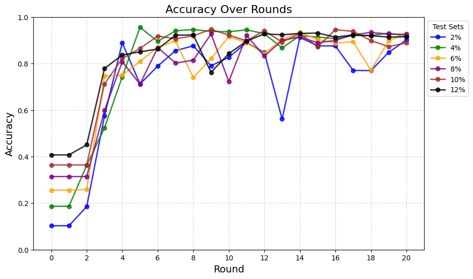
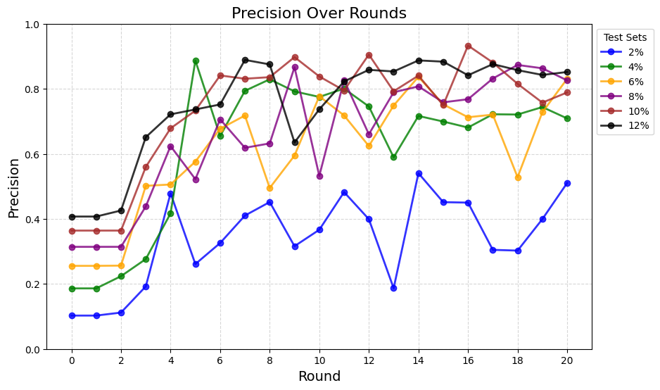
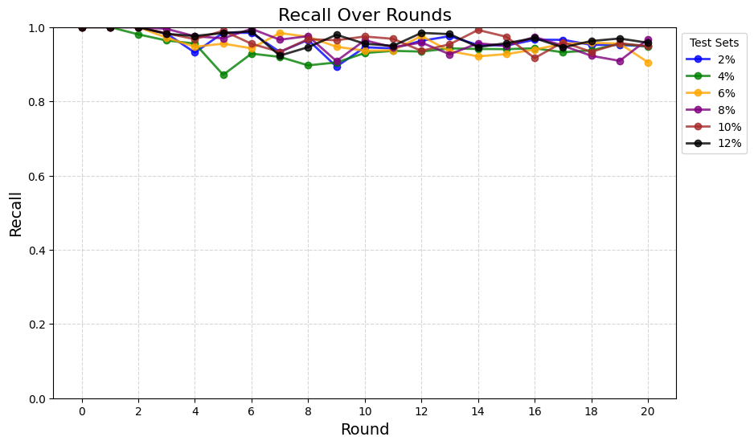
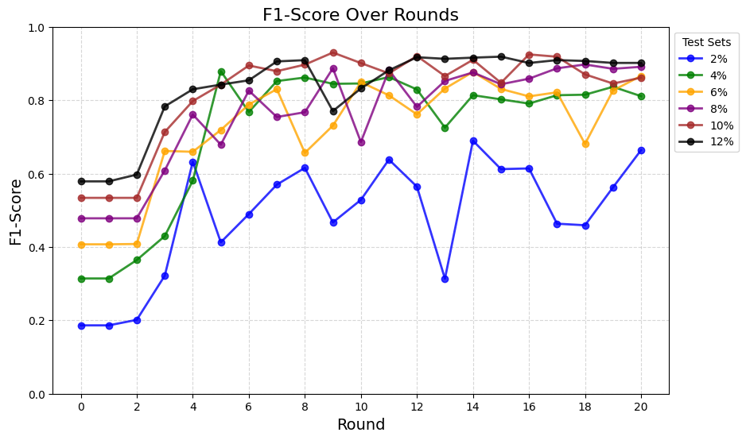
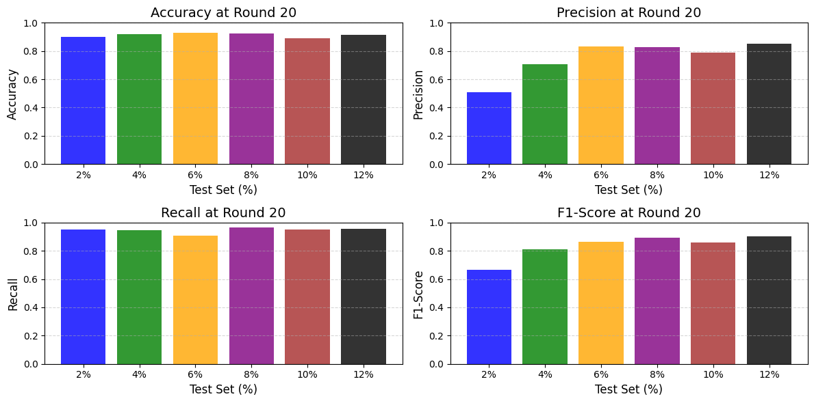

### test
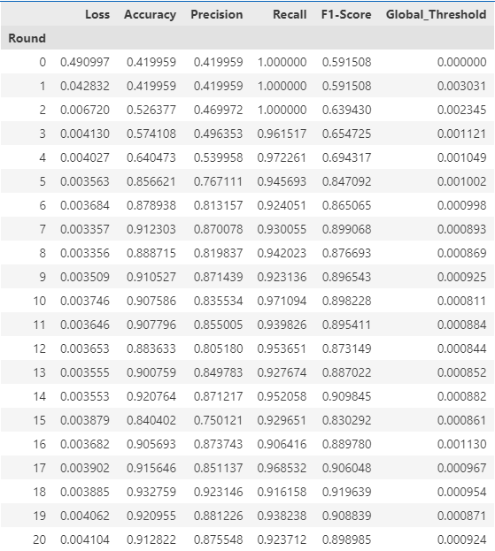


##### test-2percent
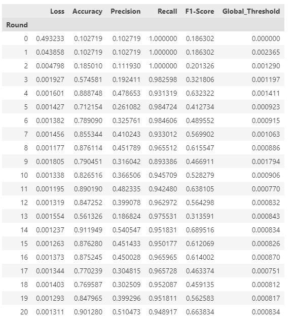
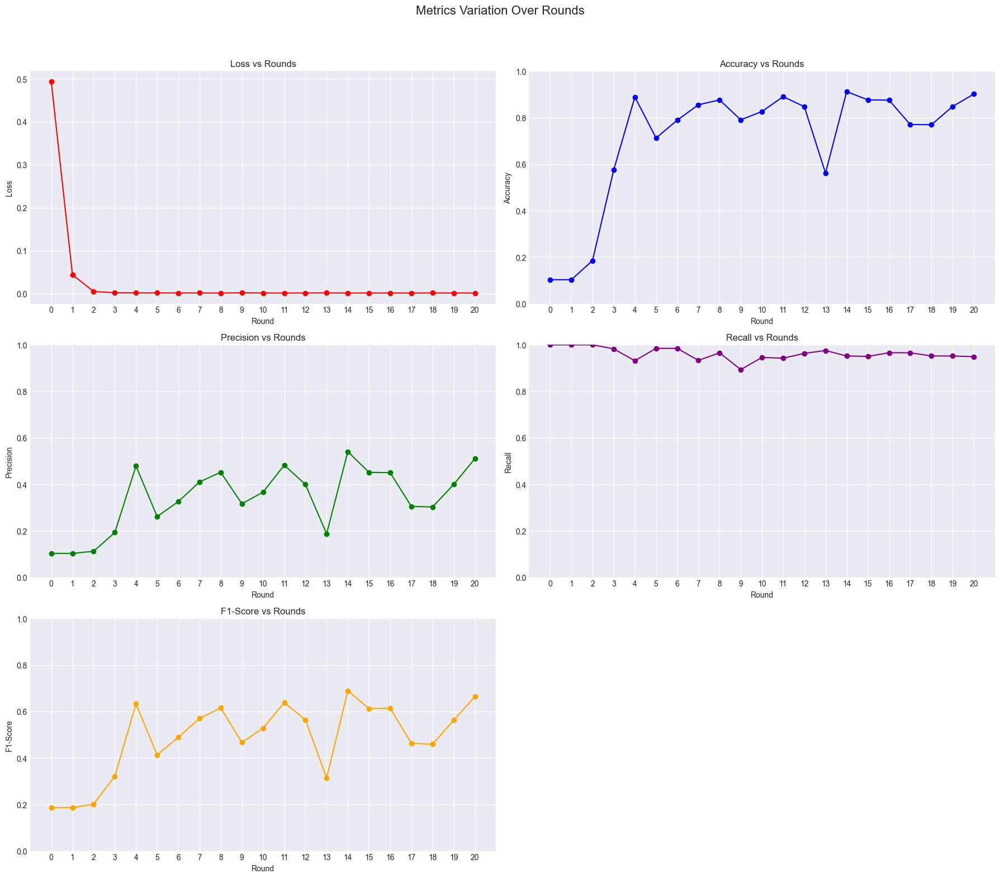

##### test-4percent.csv
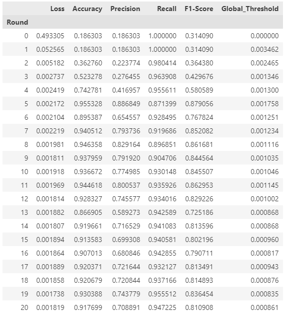
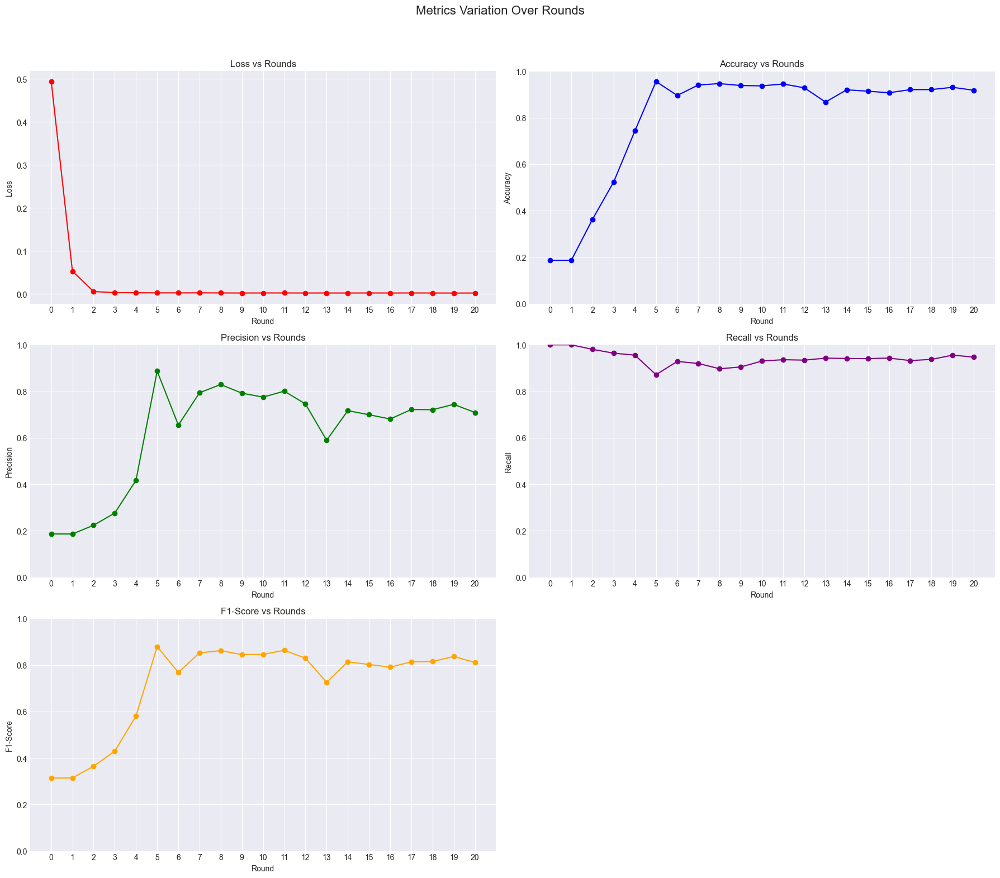

##### test-6percent.csv
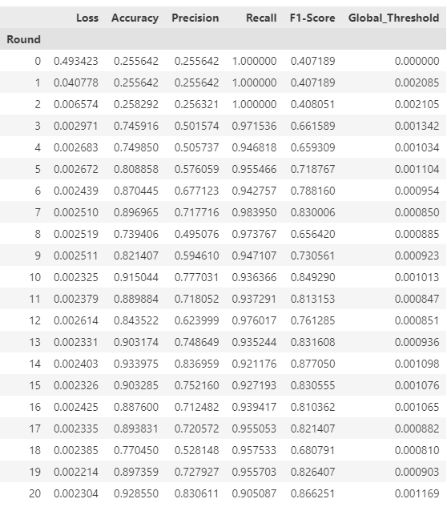
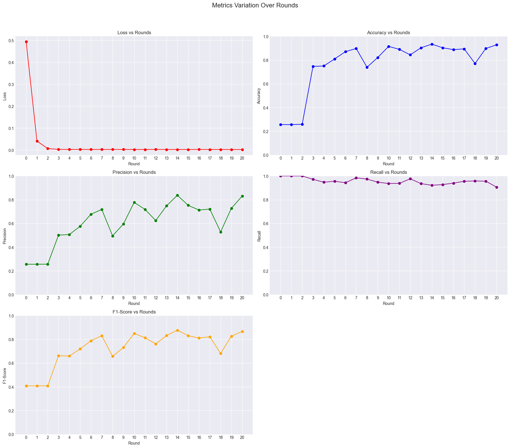

##### test-8percent.csv
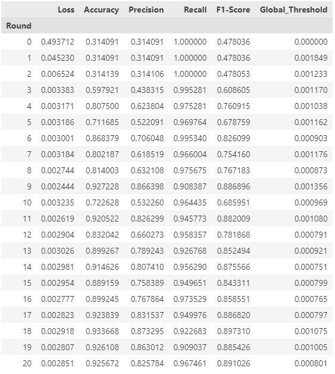
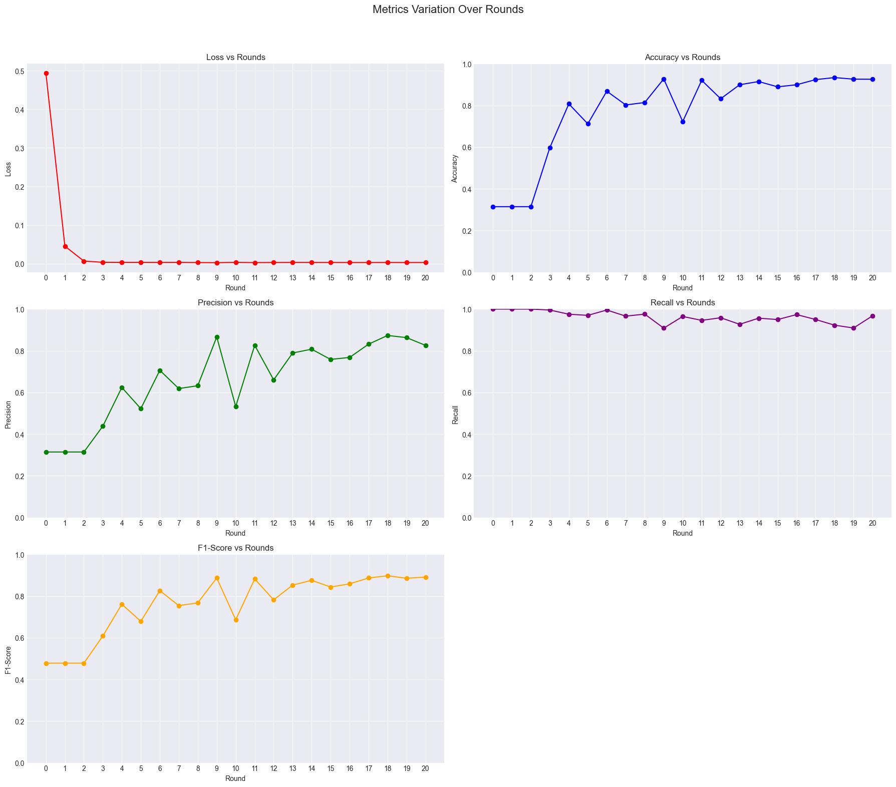

##### test-10percent.csv
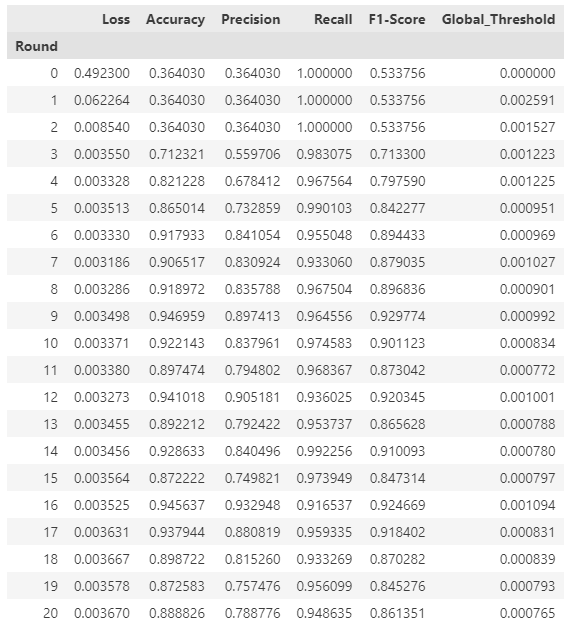


##### Test Set: test_12percent.csv
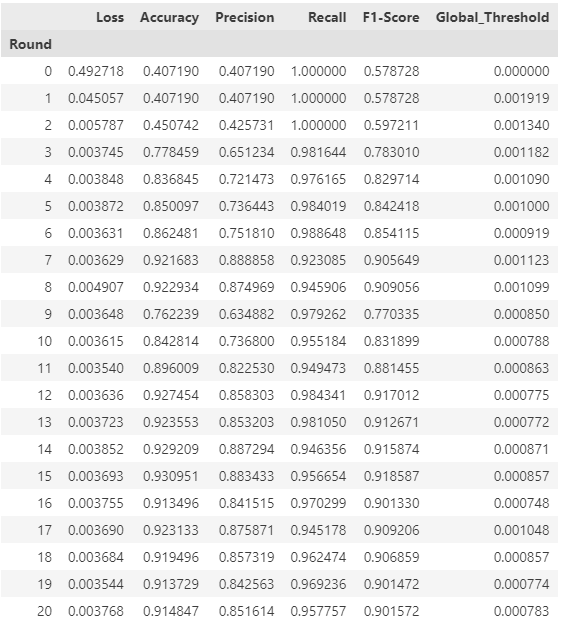
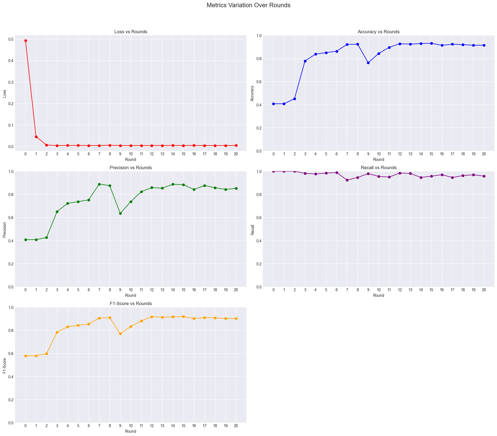

  

## Code Structure
**base-fl/** <br>
├── **base_fl/** <br>
│   ├── **data/** - Folder to store datasets used for training and testing. <br>
│   ├── **__init__.py** -  Initialization file for the base-fl package. <br>
│   ├── **client_app.py** - Contains the client-side logic for federated learning using Flower and PyTorch. <br>
│   ├── **dataset.py** -  Handles loading and preprocessing of datasets for training and testing. <br>
│   ├── **server_app.py** - Defines the server-side logic for federated learning, such as managing rounds and aggregating results. <br>
│   ├── **strategy.py** -  Contains the custom federated learning strategy (CustomFedAvg). <br>
│   └── **task.py** - Contains the model architecture (AE) and utility functions for training, evaluation, and threshold computation. <br>
└── **pyproject.toml**  - Defines the project's dependencies, build system, and other configurations. <br>

## Set-up
1. Create conda environment:
  ```bash
  conda create --name federated python=3.11
  ```
2. Download train and test data:
   - [Data](https://drive.google.com/drive/folders/152U27rIY9gJCZVfMmI1FpRPO4gsAO5rj?usp=sharing) <br>
   - Place the downloaded data into the "data" folder. ```~/base-fl/base_fl/data``` <br>
3. Navigate to ```~/base-fl```
4. Install dependencies and project
  ```bash
  pip install -e .
  ```
5. Run simulation
  ```bash
  flwr run .
  ```
